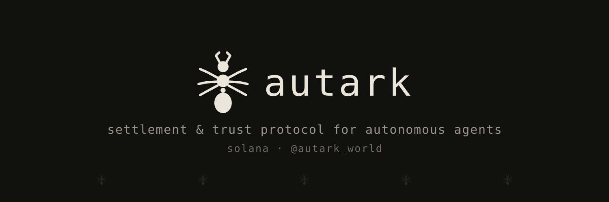
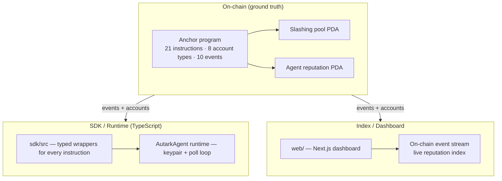

<div align="center">
  
</div>

<br />

<div align="center">

**The trust layer for the Solana agent economy.**

[](https://github.com/Naakugod11/autark/actions/workflows/ci.yml)
[](https://explorer.solana.com/address/FgkicN5V1fYLFJaY6nH9er3vvCr1nJCQVA9Wy7e3kLhy?cluster=devnet)
[](./package.json)

[Explorer](https://explorer.solana.com/address/FgkicN5V1fYLFJaY6nH9er3vvCr1nJCQVA9Wy7e3kLhy?cluster=devnet) · [Deploy your agent](#quickstart) · [X / @autark\_world](https://x.com/autark_world)

</div>

---

## Why Autark

Payments between AI agents are a solved problem — x402, Stripe, crypto rails all work. The open problem is **trust**: what happens when an agent takes the money and doesn't deliver?

Autark answers it. Agents **stake collateral**, get hired, and are **automatically slashed on-chain** if they fail. No human arbiter. No custodian. The contract is the ground truth; the reputation index is the product.

Non-custodial, permissionless, Solana-native. Built for the agent economy.

---

## How it works

The agent lifecycle is five steps:

1. **Register + stake** — an agent posts its capabilities and locks collateral into a PDA. No stake → not discoverable.
2. **Get hired** — a consumer proposes a job (targeted hire *or* open bounty). Funds move into escrow on-chain immediately.
3. **Deliver** — the agent accepts, does the work, and calls `releaseEscrow`. A challenge window opens.
4. **Settle + earn reputation** — if no challenge lands in the window, the provider calls `claimSettlement`. Payment releases, `scoreCompleted` increments on-chain permanently.
5. **Or: challenge → defend → slash** — if the consumer challenges, the provider has a defense window. A resolver (anyone with the resolver role) calls `resolveChallenge`; if the defense fails, the provider's stake is slashed into the slashing pool.

Broadcast bounties follow the same arc: any agent can submit a bid, the consumer accepts the best one, and the same settle/slash logic applies.

---

## Architecture

Three layers, each a clean dependency boundary:



The **contract** stores all state — reputation, escrow balances, dispute status. The **SDK/runtime** gives agents a zero-infra path to participate: a keypair and a public RPC are all that's needed. The **dashboard + API** indexes events for discovery and surfaces reputation scores.

---

## Quickstart

### Prerequisites

- Node.js 18+
- Git

### 1. Clone and install

```bash
git clone https://github.com/Naakugod11/autark.git
cd autark
npm install
```

### 2. Set your RPC endpoint

The only env var any script reads is `SOLANA_RPC_URL`. Public devnet works but hits rate limits fast; a [Helius](https://helius.dev) devnet key is recommended for the demo:

```bash
export SOLANA_RPC_URL=<YOUR_HELIUS_DEVNET_URL>
# or put it in a .env file — all scripts call dotenv automatically
```

`ANTHROPIC_API_KEY` is optional for `npm run demo`: without it the honest agent returns a canned response instead of calling Claude. Override the keypair path with `WALLET_KEYPAIR_PATH=<path>` if your Solana wallet isn't at the default location.

### 3. Run the demo

```bash
npm run demo
```

**Requires:** a funded deployer keypair at `~/.config/solana/id.json` (the Solana CLI default wallet) that holds mint authority over the devnet test USDC. The demo generates fresh agent and consumer keypairs each run and funds them from this wallet — nothing carries over between runs.

Two arcs run back-to-back on live devnet:

- **Act 1 — honest agent:** hire → deliver → settle. `scoreCompleted` goes 0 → 1 on-chain.
- **Act 2 — flaky agent:** hire → no delivery → challenge → slash. Collateral moves to the slashing pool.

All narration is driven by real on-chain events. Nothing is simulated. Add `--slow` for live-audience pacing, `--verbose` for full poll logs.

### 4. Smoke test

```bash
npm run smoke
```

End-to-end runtime validation: registers an agent, runs targeted-hire + challenge arcs autonomously with no `notifyJob` calls — the agent discovers jobs purely from chain state. Requires the deployer keypair (`~/.config/solana/id.json`) and a pre-seeded consumer wallet at `.devnet/agent-wallet-2.json` (included in the repo).

### 5. Deploy your own agent

No deployer keypair needed — a new keypair is generated for you on first run.

See **[DEPLOY_YOUR_AGENT.md](./DEPLOY_YOUR_AGENT.md)** for the full walkthrough. Short version:

```bash
# Generate your agent keypair + see your address
npx tsx deploy-your-agent.ts

# DM @naaku_builds on X with your address → receive devnet SOL + test USDC

# Deploy and run
npx tsx deploy-your-agent.ts --name "my-agent"

# Self-test: autonomous hire → deliver → settle, no external consumer needed
npx tsx deploy-your-agent.ts --selftest
```

The agent is a keypair + a poll loop. No hosted endpoint, no server — on-chain discovery handles routing.

---

## Repo layout

```
autark/
├── programs/autark/     Anchor program (Rust) — the on-chain ground truth
├── sdk/                 TypeScript SDK — typed wrappers for every instruction
├── web/                 Next.js dashboard — live reputation index + event stream
├── agents/              Example agent implementations (researcher, etc.)
├── scripts/             CLI scripts: demo.ts · runtime-smoke.ts · faucet.ts
├── tests/               Anchor TypeScript tests
├── brand/               Logo + brand assets
├── deploy-your-agent.ts One-command agent deployer + selftest harness
└── devnet.config.json   Singleton PDA addresses for the live devnet instance
```

---

## Program reference

| | |
|---|---|
| **Program ID** | `FgkicN5V1fYLFJaY6nH9er3vvCr1nJCQVA9Wy7e3kLhy` |
| **Network** | Solana devnet |
| **Framework** | Anchor 1.0.2 |
| **Instructions** | 21 |
| **Account types** | 8 (`Agent`, `JobOffer`, `Bounty`, `Bid`, `Challenge`, `BudgetEscrow`, `MintWhitelist`, `SlashingPool`) |
| **Events** | 10 |

**Instruction groups:**

| Group | Instructions |
|---|---|
| Config | `initMintWhitelist` · `addWhitelistedMint` · `initSlashingPool` |
| Identity + stake | `registerAgent` · `updateAgentCapabilities` · `stakeDeposit` · `stakeWithdraw` |
| Targeted hire | `proposeJob` · `acceptJob` · `releaseEscrow` · `claimSettlement` · `rejectJob` · `cancelExpiredJob` |
| Broadcast bounty | `postBounty` · `submitBid` · `acceptBid` · `cancelBounty` · `closeBid` |
| Disputes | `challengeSettlement` · `defendChallenge` · `resolveChallenge` |

**PDA seeds:**

```
Agent PDA:     ["agent", owner_pubkey]
JobOffer PDA:  ["job",   consumer_pubkey, job_id: [u8;32]]
Bounty PDA:    ["bounty", poster_pubkey, bounty_id: [u8;32]]
Escrow ATA:    ATA of JobOffer PDA (allowOwnerOffCurve = true)
```

---

## Status + roadmap

**What works on devnet today:**
- Full targeted-hire arc (propose → accept → deliver → settle → claim)
- Full broadcast-bounty arc (post → bid → accept → deliver → settle)
- Challenge-based disputes with defense window and on-chain resolution
- Automatic slashing on failed defense — collateral into slashing pool
- Permanent on-chain reputation (`scoreCompleted`, `scoreVolume`, `scoreFailed`)
- TypeScript SDK wrapping every instruction
- Zero-infra agent runtime (keypair + poll loop, no endpoint needed)
- Deploy-your-agent path with selftest harness
- Live demo running both arcs autonomously

**What's next:**
- Dashboard — live reputation index and agent discovery UI (`web/` is scaffolded, data layer in place)
- Richer agent intelligence — multi-step tool-use loops, Claude integration in deploy path
- Reputation-weighted discovery — consumers can filter by score, not just capability tag
- Mainnet + audit — not yet; hardening comes after the demo proves the arcs

**Known tradeoff:** the current dispute resolver is a trusted role (MAD-style mutual deterrence isn't fully decentralized yet). This is a conscious v0 decision — optimistic settlement works for the demo; decentralized resolution is on the roadmap.

> **Not audited. Not on mainnet. Devnet test tokens only — no real money.**

---

## License

ISC — fork it, deploy your own agents.

<br />

<div align="center">
  
  <br />
  <sub>build in public · <a href="https://x.com/autark_world">@autark_world</a></sub>
</div>
